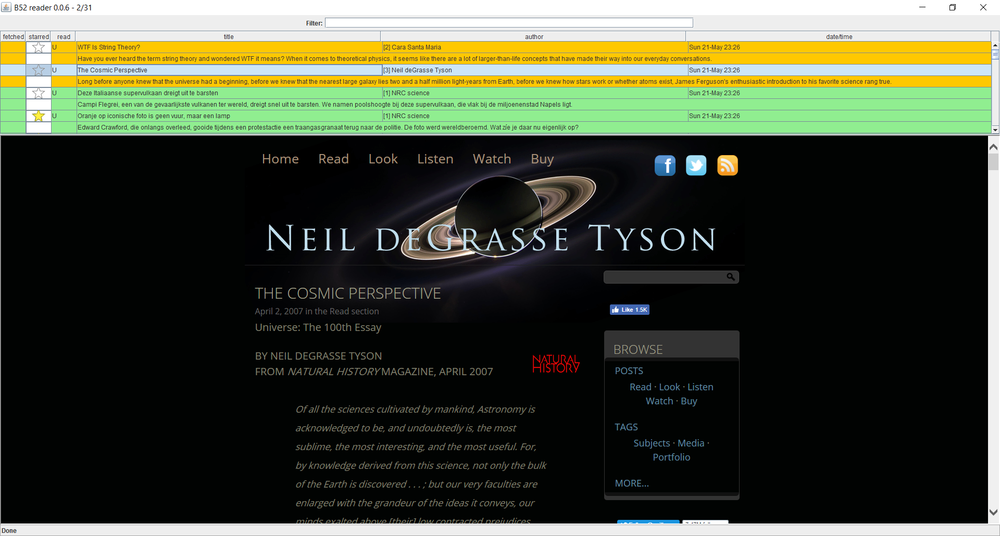

# b52-reader
A fast reader for website articles with good support for searching.

## Goals
The main goal of the b52-reader is to support anyone who wants to comfortably read articles from one or more websites with additional functionality like searching. More specifically it should enable you to:
- have a fast experience comparable to going through a list of photos, a pdf, or a presentation;
- provide good support for searching on keywords, author, and publication date;
- give multiple ways of sorting your list of articles;
- keep track of the articles that you have read.

Additional goals that could be achieved at a later stage are:
- give some sort of notification when a new article is published that seems to be important or interesting (for example based on keywords and author);
- make the experience at least as smooth as using the website directly, so no additional login requests etc.

## Technology
Java 8 desktop application using the Swing library for the GUI and either [DJ Native Swing](https://github.com/Chrriis/DJ-Native-Swing), [JxBrowser](https://www.teamdev.com/jxbrowser), or [Java-CEF](https://bitbucket.org/chromiumembedded/java-cef) for adding embedded browsers. In principle support Windows, Linux, and macOS (although my personal focus is on Windows and I don't have a macOS test device).

In order to achieve a fast and fluid experience, the b52-reader fetches multiple articles and creates browsers in the background, trying to predict which articles you are most likely to open next.

## Acknowledgements
Thanks for developers planetwide for developing great (open source) software. Specifically I would like to thank the following projects:
- the Java programming language and the JVM;
- tools: IntelliJ IDEA, git, GitHub, and Maven;
- libraries: Swing, jsoup, Apache Commons Lang, DJ Native Swing, and SWT;
- browsers: Chrome and Firefox;
- operating systems: Windows, Linux, macOS, and Unix;
- the Internet in general and Stack Overflow in particular!
