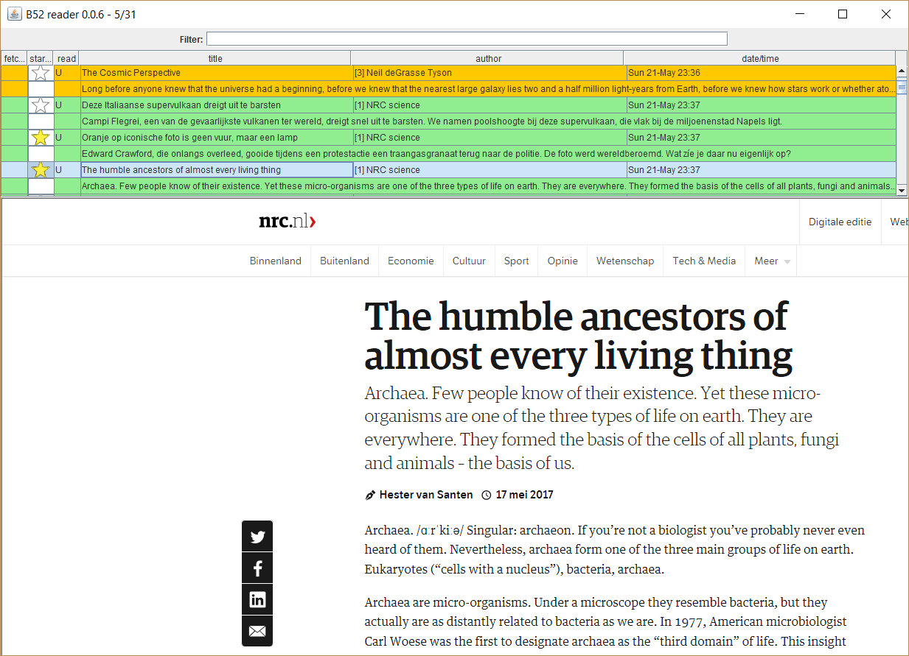

# b52-reader
A fast and simple reader for website articles from different sources that keeps track of read/starred/archived status and offers some Gmail inspired searching functionality.

## Goals
The main goal of b52-reader is to support anyone who wants to comfortably read articles from one or more websites with additional functionality like keeping track of read articles and searching. More specifically it should enable you to:
- have a fast experience comparable to going through a list of photos, pages of a pdf, or slides in a presentation;
- provide good support for searching on keywords, author, and publication date;
- give multiple ways of sorting your list of articles;
- keep track of the articles that you have read (with starred and archived support).

Additional goals that could be achieved at a later stage are:
- give some sort of notification when a new article is published that seems to be important or interesting (for example based on keywords and author);
- make the experience at least as smooth as using the website directly, so no additional login requests etc.

## Underlying technology
Java 8 desktop application using Swing library for GUI and either [DJ Native Swing](https://github.com/Chrriis/DJ-Native-Swing), [JxBrowser](https://www.teamdev.com/jxbrowser), or [Java-CEF](https://bitbucket.org/chromiumembedded/java-cef) for adding embedded browsers. In principle support Windows, Linux, and macOS (although my personal focus is on Windows and I don't have a macOS test device).

In order to achieve a fast and fluid experience, b52-reader fetches multiple articles and creates browsers in the background, trying to predict which articles you are most likely to open next.

## Acknowledgements
Thanks for developers planetwide for making great ([open source](https://en.wikipedia.org/wiki/Open-source_model)) software. Specifically I would like to thank the following projects:
- the [Java programming language](http://docs.oracle.com/javase/8/docs/technotes/guides/language/) and the [Java virtual machine](https://docs.oracle.com/javase/8/docs/technotes/guides/vm/);
- tools: [IntelliJ IDEA](https://www.jetbrains.com/idea/), [Git](https://git-scm.com/), [GitHub](https://github.com/), and [Maven](https://maven.apache.org/index.html);
- many libraries: [Swing](http://www.oracle.com/technetwork/java/architecture-142923.html), [DJ Native Swing](https://github.com/Chrriis/DJ-Native-Swing), [SWT](https://www.eclipse.org/swt/), [H2](http://www.h2database.com/html/main.html), [Lombok](https://projectlombok.org/), [jsoup](https://jsoup.org/), [ROME](https://rometools.github.io/rome/), [Log4j 2](https://logging.apache.org/log4j/2.x/), [Jackson](https://github.com/FasterXML/jackson), [Apache Commons Lang](https://commons.apache.org/proper/commons-lang/), [Guava](https://github.com/google/guava), [JUnit 4](http://junit.org/junit4/), [Mockito](http://site.mockito.org/), [EqualsVerifier](http://jqno.nl/equalsverifier/), [Awaitility](http://www.awaitility.org/), [SpotBugs](https://spotbugs.github.io/) (FindBugs successor), [SpotBugs maven plugin](https://github.com/hazendaz/spotbugs-maven-plugin), [Maven Compiler Plugin](https://maven.apache.org/plugins/maven-compiler-plugin/), [JaCoCo](https://github.com/jacoco), [Coveralls](https://coveralls.io/), [Coveralls Maven plugin](https://github.com/trautonen/coveralls-maven-plugin), [Checkstyle](http://checkstyle.sourceforge.net/), and [Checkstyle maven plugin](https://maven.apache.org/plugins/maven-checkstyle-plugin/);
- browsers: [Chrome](https://www.google.com/chrome/) and [Firefox](https://www.mozilla.org/firefox/);
- operating systems: [Windows](https://www.microsoft.com/windows/), [Linux](https://en.wikipedia.org/wiki/Linux), [macOS](https://www.apple.com/macos/), and [Unix](https://en.wikipedia.org/wiki/Unix);
- the [Internet](https://en.wikipedia.org/wiki/Internet) in general, and [Google search](https://www.google.com/) & [Stack Overflow](https://stackoverflow.com/) in particular!
